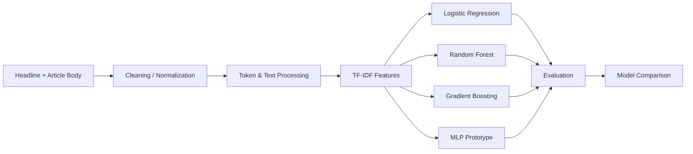

# NLP Stance Detection — Saturdays AI Monterrey 2020

> **Portfolio case study:** classical NLP and machine-learning experimentation for classifying the relationship between a news headline and an article body.

This repository contains my final NLP project from **Saturdays AI Monterrey, 4th Edition — Cycle 1 (2020)**. I have preserved the original notebooks as historical evidence of the work and added this portfolio-oriented documentation in 2026 to make the project easier to understand, review, and discuss in technical interviews.

## Executive summary

The project explores a four-class stance-detection problem:

- **agree**
- **disagree**
- **discuss**
- **unrelated**

The workflow combines text preprocessing, TF-IDF feature engineering, supervised machine learning, model comparison, hyperparameter-search experiments, and a neural-network prototype.

### Why this project is useful in my portfolio

It demonstrates hands-on experience with the full ML experimentation loop:

**data → preprocessing → feature engineering → model training → tuning → evaluation → comparison**

It also provides a useful contrast with modern GenAI systems: before retrieval-augmented generation and LLM agents became mainstream, this project addressed semantic relationship classification using interpretable classical NLP pipelines.

---

## Problem

Given a **headline** and a **news article body**, predict the stance of the article relative to the headline.

This is more demanding than simple topic classification because the model must reason about the relationship between two pieces of text rather than classify one document in isolation.

## Data flow



## Models explored

| Model | Repository artifact | What it demonstrates |
|---|---|---|
| Ridge / L2 Logistic Regression | `Ridge_Logistic_Regression.ipynb` | Linear baseline, multiclass classification, regularization, hyperparameter search |
| Random Forest | `Random_Forrest.ipynb` | Ensemble learning and nonlinear decision boundaries |
| Gradient Boosting | `Gradient_Boosting_Machine.ipynb` | Boosted ensemble experimentation and tuning |
| One-hidden-layer MLP | `MLP_one_hiden_layer.ipynb` | Early neural-network experimentation with TensorFlow-era APIs |
| Data understanding & standardization | `Understand and Standarize Examples.ipynb` | Data preparation, class encoding, text cleanup, TF-IDF generation, feature inspection |

## Feature engineering

The preprocessing notebook includes:

- class encoding for the four stance labels;
- headline/article-body handling;
- text normalization;
- TF-IDF vectorization;
- unigram and bigram features;
- train/test splitting;
- exploratory feature analysis with chi-square statistics;
- serialization of intermediate artifacts for downstream model experiments.

One saved experiment shows a TF-IDF matrix of approximately **42k training rows × 300 features** and **7.5k test rows × 300 features**.

## Model evaluation approach

The notebooks use or prepare:

- train/test accuracy;
- classification reports;
- confusion matrices;
- randomized hyperparameter search;
- grid-search refinement;
- reproducible random seeds.

The repository intentionally retains the original notebook outputs, including interrupted searches and legacy-code errors. These are useful evidence of the actual experimental process, but they also mean the project should **not** be represented as a production-ready package in its current form.

---

## Repository structure

```text
.
├── Understand and Standarize Examples.ipynb
├── Ridge_Logistic_Regression.ipynb
├── Random_Forrest.ipynb
├── Gradient_Boosting_Machine.ipynb
├── MLP_one_hiden_layer.ipynb
├── train_bodies.csv
├── train_stances.csv
├── test_bodies.csv
├── test_stances_unlabeled.csv
├── decks/
│   └── 2020_Mty_Saturdays_Project_BKaramanosvDEMODAY.pptx
└── docs/
    ├── modernization-roadmap.md
    └── model-card.md
```

## Technology used in the original project

- Python
- Jupyter / Google Colab
- pandas / NumPy
- scikit-learn
- NLTK
- TF-IDF / n-grams
- TensorFlow 1.x-era APIs
- matplotlib / seaborn

## Engineering observations

This repository was created as a learning project in 2020. Several implementation details are now dated:

1. The MLP notebook uses TensorFlow APIs such as `tf.contrib` and placeholders that are incompatible with current TensorFlow releases.
2. Some hyperparameter-search cells were interrupted or saved without final output.
3. Data and notebooks are stored at the repository root instead of being separated into `data/`, `notebooks/`, and `src/`.
4. The original project does not pin a fully reproducible environment.
5. Accuracy alone is not sufficient for an imbalanced four-class problem; macro-F1, per-class recall, and confusion analysis should be first-class metrics.
6. There is no automated test or CI pipeline.

These limitations are documented rather than hidden because they make the modernization path—and the engineering decisions behind it—clear.

## 2026 modernization direction

A production-quality refresh would:

- rebuild preprocessing as a tested Python package;
- use a `Pipeline` / `ColumnTransformer` workflow to prevent train-test leakage;
- report macro-F1, weighted-F1, per-class recall, and confusion matrices;
- establish a majority-class and linear baseline before more complex models;
- replace the TensorFlow 1.x prototype with modern Keras or PyTorch;
- add a transformer baseline for comparison;
- add ML experiment tracking and deterministic configuration;
- package inference behind a small API;
- add CI tests for preprocessing and inference;
- add model and data cards describing limitations and intended use.

See **[docs/modernization-roadmap.md](docs/modernization-roadmap.md)** for the proposed technical roadmap.

## What I would discuss in an interview

This project gives me a concrete example for discussing:

- how to turn raw text into ML-ready features;
- why model baselines matter;
- how to compare linear, ensemble, and neural approaches;
- the impact of class imbalance on evaluation;
- the difference between experimentation and production ML;
- technical debt created by fast-moving ML frameworks;
- how I would modernize an older ML asset into a governed, deployable service.

## Historical context

The original code and notebooks were produced in **2020** as part of the Saturdays AI Monterrey program. The portfolio documentation added in **2026** does not change the historical implementation; it makes the project easier to evaluate and explains how I would evolve it using current engineering practices.

---

### Related portfolio theme

This repository represents the **classical ML/NLP foundation** of my AI portfolio. My newer projects extend that foundation toward GenAI, RAG, AI agents, governance, and enterprise AI delivery.
